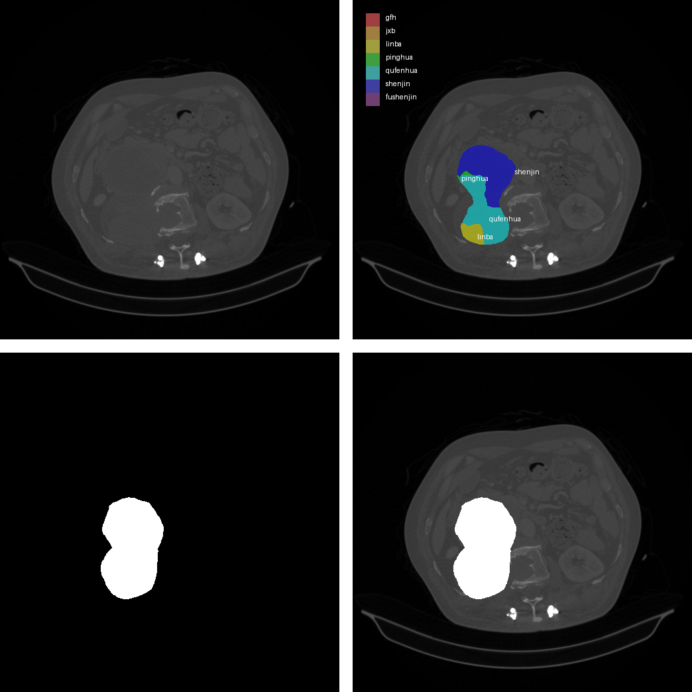
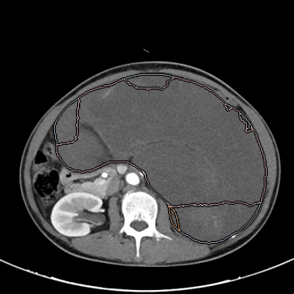
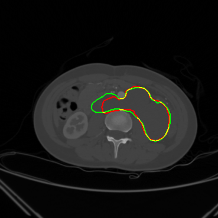
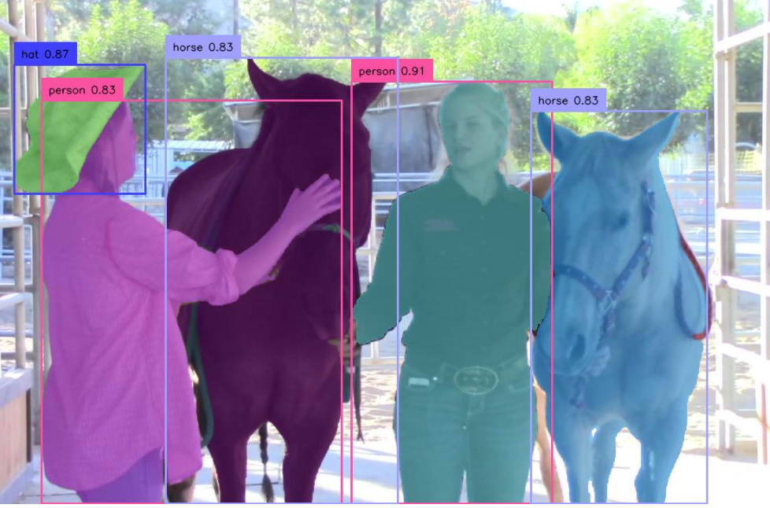

# 关于我

## 🔬 科研与项目经历

### **原发性腹膜后肿瘤诊断与分割（多中心研究）** *(2024.01–2024.12)*
{ width="30%" }
{ width="30%" }
{ width="30%" }

- 搭建 3D 医学图像深度学习框架，实现 **肿瘤区域精准分割与分类**  
- 引入医学图像预训练大模型、视频目标检测方法改进分割效果  
- 完成数据预处理（DICOM → NIfTI）、Linux/conda 实验环境搭建  
- **成果**：论文发表于 *Eclinicalmedicine*  

### **双时医学图像变化的时序分割方法** *(2024.01–2024.12)*
{ width="100%" }

- 借鉴**视频分割方法 DEVA**的时序传播机制，用于双时 CT 图像变化检测
- 捕捉时间维度细微差异，提高分割的一致性与鲁棒性
- **成果**显著提升 Dice 指标，申请发明已完成

### **Context and Orientation Correction** (EAAI, 2023)
{ width="100%" }

- 针对弱监督遥感目标检测中的 **上下文模糊与方向不确定性** 问题，提出 **Context and Orientation Correction (COC) 框架**  
- **创新点**：  
    - **上下文校正模块**：利用风格归一化，缓解实例间上下文差异，提升异常目标识别能力  
    - **方向校正模块**：基于对比学习，缩小不同方向实例的特征距离，保证目标表征一致性  
    - **类别感知聚合损失**：提升同类目标特征相似度，解决对比学习中的类别冲突问题
- **成果**：  
    - DIOR 数据集 mAP = **27.6%**  
    - NWPU VHR-10.v2 数据集 mAP = **59.8%**  
- 论文发表于 **Engineering Applications of Artificial Intelligence (EAAI, 2023)**

### **多模态肺炎分类** *(2024.06–至今)*
- 设计 **CT + 临床数据** 的融合框架，引入跨模态注意力机制  
- 提升肺炎分类准确率，性能优于单模态模型  
- **成果**：论文准备投稿 *IEEE TMI* 

### **联邦学习框架 FedFed 研究与复现**  *(2023.10 – 2023.12)*
· PyTorch · CIFAR-10/100 · 分布式训练 · 差分隐私

- 复现 NeurIPS FedFed，实现 FedAvg/Prox/SCAFFOLD，10 客户端 1000 轮通信  
- 去除 VAE 蒸馏 + 共享数据，收敛速度 ↑2.3×，准确率 ↑5.1%（90.6% vs 85.7%）  
- 解决 CUDA kernel、cuDNN、BatchNorm 兼容性等底层 bug，训练稳定 <10 h  
- 基于 Dirichlet 构造 non-IID 数据，wandb 追踪，完整实验-日志-可视化闭环
- 撰写技术博客 2 篇（CSDN 阅读量 2k+），系统总结环境配置、代码解析与实验对比
  - [查看博客文章](https://blog.csdn.net/weixin_51375278/article/details/147574540?fromshare=blogdetail&sharetype=blogdetail&sharerId=147574540&sharerefer=PC&sharesource=weixin_51375278&sharefrom=from_link)

---

## 📄 **发表论文**
- *Eclinicalmedicine* — End-to-End Deep Learning for Retroperitoneal Tumor Segmentation (2024)  
- *EAAI* — Contextual and Orientation Correction Modules Enhance Weakly-Supervised Aerial Object Detection (2023)  
- *IEEE TMI*（在投） — Multimodal Learning for Pneumonia Classification (2025)  

---

## 💻 **技术技能**
- **深度学习框架**：PyTorch, TensorFlow, mmAction2, nnUNet, DEVA  
- **医学图像处理**：LVM-Med, MONAI, DICOM/NIfTI, SimpleITK  
- **多模态学习**：图像 + 表格/文本融合，视频目标检测  
- **工程与工具**：Linux, Docker, Git, Hadoop, Spark  
- **编程语言**：Python, C++, C#, SQL  
- **可视化**：ECharts, Matplotlib, Seaborn  

## 🏆 **荣誉与竞赛**
- ICPC 亚洲区域赛铜奖（C++）  
- 全国大学生数学建模竞赛 一等奖  
- 全国大学生英语竞赛 一等奖  
- 美国大学生数学建模 H 奖  
- 中国高校计算机大赛-天梯赛省三 